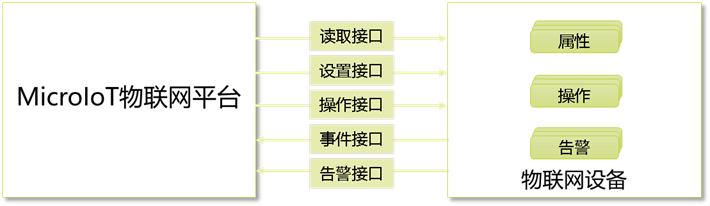
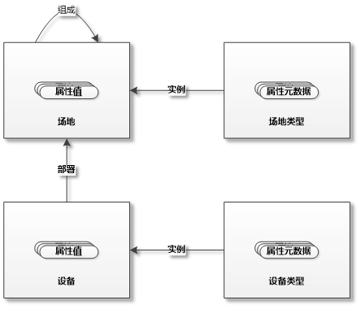
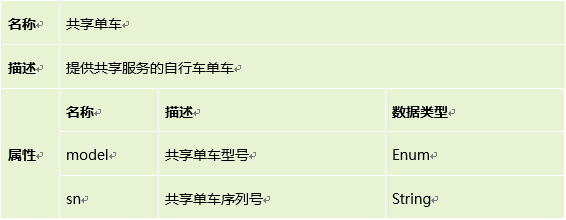
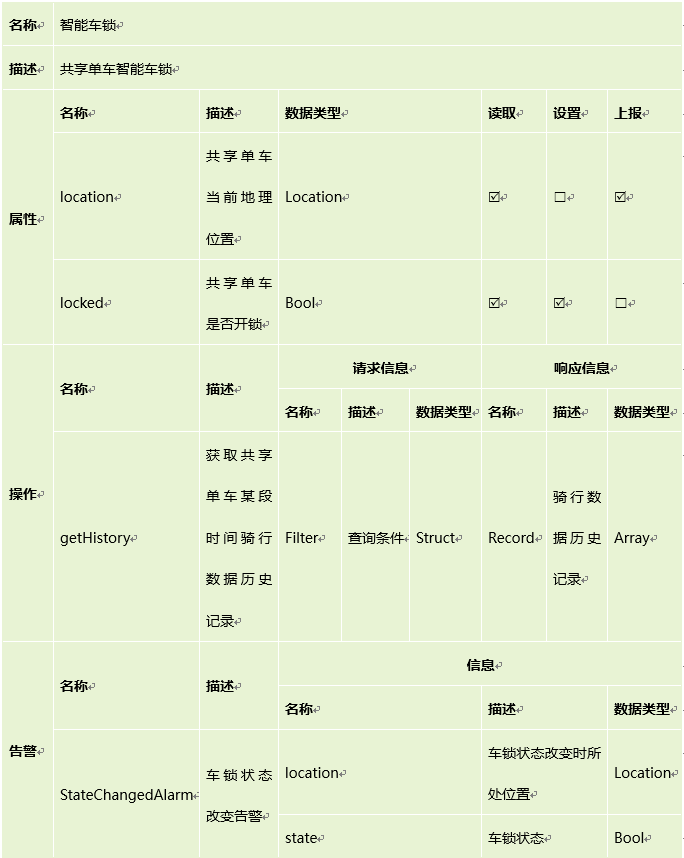
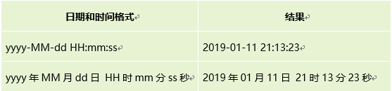

# 核心概念

要了解MicroIoT物联网平台，必须清楚以下几个核心概念:

## 设备和设备类型

物联网中的“物”在MicroIoT中被称为设备，MicroIoT可以从设备中读取数据值，也可以通过设备设置数据值，MicroIoT也可以向设备下发命令，执行一定的逻辑操作。反过来，设备也可以向MicroIoT主动上报数据值，或者在发现意外状况时，主动上报一些信息。前面所提到的数据，在MicroIoT中叫做属性，MicroIoT可以读取、设置属性值，设备主动上报的属性值，在MicroIoT中叫做事件，设备接收的命令，在MicroIoT中叫做操作，设备主动上报的意外状况信息，在MicroIoT中叫做告警。

设备类型是对设备的抽象，它描述了设备的元数据信息。包括属性的元数据，操作的元数据和告警的元数据。属性是设备上可以监控的数据，属性值可以被MicroIoT读取、设置。属性的元数据包括：名称，数据类型，是否可空，是否可读取，是否可设置，是否可上报事件等。如果MicroIoT需要与设备执行不针对某个属性的交互，这时候可以定义操作，操作由MicroIoT发起请求，设备返回响应。操作的元数据包括：请求数据类型和响应数据类型等。告警是设备检测到意外情况时，主动上报MicroIoT的信息。告警的元数据包括：告警类型，告警信息数据类型等。

下图展示了MicroIoT平台与设备之间的关系。

设备的属性值保存在设备中，有一类特殊的属性，它的属性值保存在MicroIoT平台中，这种属性被称作静态属性，用于保存设备的静态值，而前面所说的属性，是保存在设备内的动态值，也称作动态属性。设备还是用户权限分配中最小的分配单元，详细信息见[用户管理](/system/#_3)。

## 场地和场地类型

场地是设备所处的逻辑位置，一个场地可以部署多个设备，一个场地也可以由多个场地组成。例如一个学校由多个教学楼组成，一个教学楼又包含多个教室和办公室等。学校，教学楼，教室，办公室都是场地，在这些场地中可以部署设备。MicroIoT中的场地可以是一般意义的真实、可见的地方，也可以是逻辑位置，场地可以部署物联网设备，也可能是物联网设备监控的对象，所有这些实体，都可以抽象为场地。

场地类型是对场地的抽象，描述场地的属性信息，包括属性名称，数据类型，是否可空等信息。场地和设备的关系有些类似目录和文件的关系。一个父场地可以包含多个子场地，一个场地可以部署多个设备，场地是场地类型的实例，设备是设备类型的实例。场地，场地类型，设备，设备类型之间的关系如下图。

场地的属性值保存在MicroIoT中。场地内可以包含多个场地和设备，是场地和设备的集合，可以作为用户权限分配的单元。具体信息见[用户管理](/system/#_3)。

下面以共享单车为例，展示场地类型和设备类型在MicroIoT中的具体应用。共享单车是大家熟知的提供共享服务的自行车单车。在本示例中共享单车有两个属性：model型号和sn序列号。共享单车配有智能车锁。在MicroIoT系统中，共享单车是一个场地，智能车锁是部署在共享单车上的设备。下表列出了共享单车场地类型的元数据信息。

每个共享单车配有一副智能车锁，系统可以给智能车锁发送命令开锁，也可以用户手动关锁。车锁状态改变时，智能车锁可以上报告警，也可以定时上报实时位置信息，平台也可以查询位置信息。另外系统可以从智能车锁获取某个时间段的骑行数据。下表列出了智能车锁设备类型的元数据信息。

## 数据类型

数据类型是定义设备类型和场地类型中非常重要的部分，MicroIoT当前支持十种数据类型，包括七种简单数据类型和三种复杂数据类型。

简单数据类型包括：

- Int：整数数据
- Decimal：小数数据
- Bool：布尔数据
- Enum：枚举数据，对于Enum数据类型，需要设置枚举值，枚举值中间用英文分号；隔开。例如Enum数据类型color，定义其枚举值为：red;orange;yellow;green;blue;purple;
- Date：日期和时间数据，对于Date数据类型的属性，需要设置该属性使用的日期格式。MicroIoT采用Java语言的日期格式模式，下面是一些常用的日期格式例子。日期格式的详细描述请见[Java文档](https://docs.oracle.com/javase/7/docs/api/java/text/SimpleDateFormat.html)。

- Location：位置数据，支持基于空间数据各种查询
- String：字符串数据，String数据类型的属性，可以配置字符串的最小长度或者最大长度。

复杂数据类型包括：

- Array：数组数据，对于Array数据类型的属性，需要配置数组内具体的数据类型，可以是其他任意的数据类型，但是不能是Array。例如Array的具体的数据类型配置为Int，这个属性的数据类型就是整数数组。
- Struct：结构数据，结构数据类型内部包含多个属性，需要定义附加信息描述内部的每一个属性。
- Choice：任意类型的数据，Choice数据类型是数据类型的集合，一个Choice数据类型的属性，它的实际数据类型可以是Choice定义的数据类型集合中任意的一个。例如一个名为bird的Choice数据类型，它的内部定义了多个Struct数据类型，分别是chicken，duck，penguin，eagle，那么一个bird数据类型的属性，它的实际数据类型可以是chicken，duck，penguin，eagle中任何一个。

## 设备组

在物联网产品中，经常会有物联网设备在没有人为干预的情况下，自主根据监控信息做出动作，完成特定目的的工作。在MicroIoT平台中可以定义一个设备组，其中包含多个相互协作的设备，共同配合完成一项工作。在MicroIoT中一般设备之间不能相互通信，只能与应用端通信。通过定义设备组，设备组内的设备之间可以相互订阅接收告警，获取、设置属性值，执行操作。一个设备组可以包含多个设备，一个设备也可以属于多个设备组。设备组内设备之间的协作使用MicroIoT提供的API编程完成。

## 领域

领域是一组相关的设备类型、场地类型、设备、场地、设备组等实体的组合，用于逻辑分割MicroIoT系统。一个MicroIoT系统可以有多个领域。每个领域有自己独立的一套实体。

每个领域是相互逻辑隔离的，相当于一个独立的物联网平台。设备类型，场地类型，设备，场地等信息不能互通。一个领域内包含若干场地和设备，可以作为用户权限分配的单元。具体信息见[用户管理](/system/#_3)。
