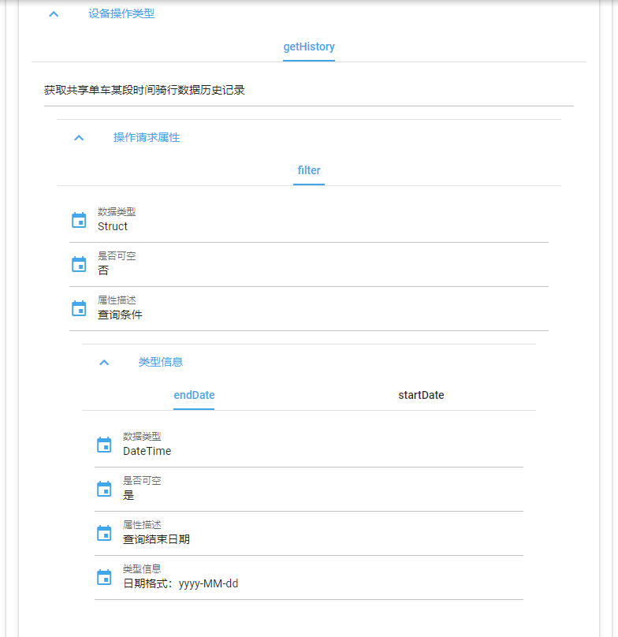

监控API支持断线自动重连，在弱网络环境下保证物联网数据可靠传输。API屏蔽了底层的网络协议接口，数据序列化、反序列化操作，线程同步等通信协议栈技术细节，开发人员只需要告诉API对哪个设备做什么操作，底层通信机制对开发人员完全透明化，真正做到业务和技术关注点分离，极大提高物联网产品开发效率和产品质量。

监控API使用websocket连接为物联网应用与设备之间建立双向通信通道，API底层连接使用websocket，因此使用`WebsocketClientSession`类建立与MicroIoT平台的连接。监控API为物联网应用提供以下服务：

- 读取设备属性值
- 设置设备属性值
- 执行设备操作
- 订阅设备告警

设备监控采用请求/响应的方式，应用端发起请求，经过MicroIoT平台发送给目标设备，设备端收到请求后实时返回响应，响应经过MicroIoT平台返回给应用端。告警订阅则采用订阅/发布方式，应用端首先告知MicroIoT平台订阅某个设备的告警信息，设备端在发生异常情况时，将告警信息通过REST API上报平台，平台将告警信息发布给所有告警订阅者。

监控API在读取属性值，设置属性值，执行操作时，即支持同步调用方式，也支持异步调用方式。所谓同步调用是指应用端程序发出调用请求后，在没有得到调用结果前，程序一直等待结果，直到设备端返回响应结果。异步调用与同步调用不同点在于，应用端程序发出调用请求后直接返回，当设备端返回响应结果时，应用端程序通过事先指定的回调函数处理响应结果。

本节将使用共享单车作为例子展示监控API的使用，关于共享单车如何在MicroIoT中建模，请参见[入门指南](../start/concept.md#bike)部分的介绍。调试应用端监控程序操作设备时，如果还没有开发出实际的设备，可以使用MicroIoT Device模拟设备产生响应，上报告警。

## 读取设备属性值

### 同步读取

下面的示例程序以同步的方式读取智能车锁的location属性，该属性的数据类型是Location。同步读取的方法是`get`。`get`只需要指定设备id，属性名称，以及属性的数据类型即可返回该设备当前属性值。

```java
@SpringBootApplication(exclude={MongoAutoConfiguration.class})
public class GetDemoApplication implements CommandLineRunner{
	@Autowired
	private WebsocketClientSession session;
	
	public static void main(String[] args) {
		SpringApplication.run(GetDemoApplication.class, args);
	}

	@Override
	public void run(String... args) throws Exception {
		String deviceId = "5ddb83fb0e8e3d0001f60ed3";
		
		Location location = session.get(deviceId, "location", Location.class);
		System.out.println("location: " + location.getLongitude() + ", " + location.getLatitude());
	}
}
```

!!! note "注意"
    程序中的deviceId可以通过查询API得到，更简单的办法是使用MicroIoT Studio，打开设备的详细信息页面，页面的url最后部分就是设备的id。例如如果某个设备详细信息的url是`https://www.microiot.top/studio/#/home/sites/5ddb2fbe0e8e3d0001f60ec9/device/5ddb83fb0e8e3d0001f60ed3`，则该设备id是`5ddb83fb0e8e3d0001f60ed3`。

上面的例子展示的是简单数据类型属性的使用，关于如何使用复杂数据类型的详细介绍，请参见[数据类型处理](./datatype.md)。

### 异步读取

异步读取方法`getAsync`与同步读取方法`get`唯一不同的地方是指定了一个回调函数，用于处理异步响应结果。下面的程序以异步的方式读取智能车锁的location属性。在回调函数`GetHandler`类中处理location属性的结果。

```java
@SpringBootApplication(exclude={MongoAutoConfiguration.class})
public class GetDemoApplication implements CommandLineRunner{
	@Autowired
	private WebsocketClientSession session;
	@Autowired
	private GetHandler onGet;
    
	public static void main(String[] args) {
		SpringApplication.run(GetDemoApplication.class, args);
	}

	@Override
	public void run(String... args) throws Exception {
		String deviceId = "5ddb83fb0e8e3d0001f60ed3";
		
		session.getAsync(deviceId, "location", Location.class, onGet);
		System.out.println("location: " + location.getLongitude() + ", " + location.getLatitude());
	}
}
```

编写异步读取的回调函数步骤很简单，只需要继承`GetResponseSubscriber`类，在`onGetResult`方法中实现读取结果处理，在`onGetError`方法中实现读取出错时的处理。

```java
@Component
public class GetHandler extends GetResponseSubscriber {

	@Override
	public void onGetError(Device device, String attribute, String error) {
		System.out.println(device.getString() + " get attribute[" + attribute + "] error:" + error);
	}

	@Override
	public void onGetResult(Device device, String attribute, Object value) {
		if(attribute.equals("location")) {
			Location location = (Location)value;
			System.out.println("async " + DeviceDef.AttributeLocation + ": " + location.getLongitude() + ", " + location.getLatitude());
		}
	}
}
```

异步读取API已经处理好读取的结果，用户只需要将`onGetResult`方法中的value值转变成相应的数据类型即可。

## 设置设备属性值

### 同步设置

同步设置属性值的方法是`set`，`set`方法的三个参数分别是设备id，属性名称，属性值，下面的例子设置智能车锁的locked属性。locked属性的数据类型为boolean。

```java
@SpringBootApplication(exclude={MongoAutoConfiguration.class})
public class GetDemoApplication implements CommandLineRunner{
	@Autowired
	private WebsocketClientSession session;
	
	public static void main(String[] args) {
		SpringApplication.run(GetDemoApplication.class, args);
	}

	@Override
	public void run(String... args) throws Exception {
		String deviceId = "5ddb83fb0e8e3d0001f60ed3";
        boolean locked= true;
		
		session.set(deviceId, "locked", locked);
	}
}
```

### 异步设置

异步设置属性值的方法是`setAsync`，`setAsync`方法在同步设置方法`set`的基础上增加了异步处理回调函数，异步处理回调函数可以使用Spring的注解自动注入。下面的异步设置属性locked的示例使用`SetHandler`类异步处理设置结果。

```java
@SpringBootApplication(exclude={MongoAutoConfiguration.class})
public class GetDemoApplication implements CommandLineRunner{
	@Autowired
	private WebsocketClientSession session;
	@Autowired
	private SetHandler onSet;
	
	public static void main(String[] args) {
		SpringApplication.run(GetDemoApplication.class, args);
	}

	@Override
	public void run(String... args) throws Exception {
		String deviceId = "5ddb83fb0e8e3d0001f60ed3";
        boolean locked= true;
		
		session.setAsync(deviceId, "locked", locked, onSet);
	}
}
```

异步处理设置结果类的实现继承自MicroIoT API提供的类`SetResponseSubscriber`，在`onSetResult`方法中实现异步设置属性值成功后的处理逻辑，在`onSetError`方法中实现异步设置属性值失败后的处理逻辑。下面是异步设置locked属性值的示例程序。`onSetResult`方法中的value参数是设置成功后的属性值，device是被设置的设备信息，attribute是属性名称。

```java
@Component
public class SetHandler extends SetResponseSubscriber {

	@Override
	public void onSetResult(Device device, String attribute, Object value) {
		if(attribute.equals("locked")) {
			boolean locked = (Boolean)value;
			System.out.println("locked: " + locked);
		}
	}

	@Override
	public void onSetError(Device device, String attribute, Object value, String error) {
		System.out.println(device.getString() + " set attribute[" + attribute + "] error: " + error);
	}

}
```


## 执行设备操作

智能车锁定义了一个操作getHistory，用于查询共享单车某段时间骑行数据历史记录，它的请求参数filter，是一个结构数据类型，包含一个查询起始日期startDate和一个查询结束日期endDate。下图是filter在MicroIoT Studio中的定义。



getHistory的响应参数records的数据类型是结构数组，结构中包含四个属性：骑行开始位置startLocation，骑行开始时间startTime，骑行结束位置endLocation，骑行结束时间endTime。records在MicroIoT Studio中的定义如下图所示。


在执行设备操作getHistory前，必须先定义好操作的请求类和响应类，filter和records都是复杂数据类型，它们的定义稍微复杂一些。

<a name="filter"></a>
```java
@Data
@NoArgsConstructor
@AllArgsConstructor
public class Filter {
	private Date startDate;
	private Date endDate;
}
```

上面是filter结构数据类型在java中的定义，其中使用了[Lombok](https://projectlombok.org/)帮助我们定义结构数据类型，当然不使用Lombok也可以，只需要自己定义JAVA POJO即可。定义结构数据类型需要注意的是结构数据类型中的属性名称必须与MicroIoT平台中定义的属性名称完全一致，否则在对数据序列化、反序列化的过程中会出错。

<a name="record"></a>
```java
@Data
@NoArgsConstructor
@AllArgsConstructor
public class Record {
	private Location startLocation;
	private Date startTime;
	private Location endLocation;
	private Date endTime;
}
```

records响应参数是结构数组数据类型，上面的类定义了records内的结构数据类型，可以发现类的属性名称与MicroIoT平台中的属性名称完全一致。

### 同步操作

同步操作的方法`action`有四个参数：设备id，操作名称，操作请求信息，操作响应信息类型。getHistory操作的响应信息类型是结构数组，需要使用`ParameterizedTypeReference`传递数组的参数化类型信息，这里使用的是`List`，也可以选择使用`Set`。

```java
@SpringBootApplication(exclude={MongoAutoConfiguration.class})
public class ActionDemoApplication implements CommandLineRunner{
	@Autowired
	private WebsocketClientSession session;
	
	public static void main(String[] args) {
		SpringApplication.run(ActionDemoApplication.class, args);
	}

	@Override
	public void run(String... args) throws Exception {
        String deviceId = "5ddb83fb0e8e3d0001f60ed3";
		Filter filter = new Filter(new Date(), new Date());
		
		List<Record> records = session.action(deviceId, "getHistory", filter, new ParameterizedTypeReference<List<Record>>() {});
	}

}
```


### 异步操作

异步操作与异步读取、异步设置类似，比同步操作多了一个异步处理回调函数。异步操作的方法是`actionAsync`，下面是使用`actionAsync`方法执行智能车锁getHistory操作的例程。回调函数`ActionHandler`类处理操作getHistory的结果。

```java
@SpringBootApplication(exclude={MongoAutoConfiguration.class})
public class ActionDemoApplication implements CommandLineRunner{
	@Autowired
	private WebsocketClientSession session;
	@Autowired
	private ActionHandler onAction;
	
	public static void main(String[] args) {
		SpringApplication.run(ActionDemoApplication.class, args);
	}

	@Override
	public void run(String... args) throws Exception {
        String deviceId = "5ddb83fb0e8e3d0001f60ed3";
		Filter filter = new Filter(new Date(), new Date());
		
		session.actionAsync(deviceId, "getHistory", filter, new ParameterizedTypeReference<List<Record>>() {}, onAction);
	}
}
```

异步操作回调函数类继承自`ActionResponseSubscriber` 类，用户在`onActionResult`方法中实现异步操作结果处理逻辑，其中`action`参数是操作名称，`request`是操作的请求值，`response`是操作的响应值，device是被执行操作的设备详细信息。在`onActionError`方法中是异步操作出错的处理逻辑。

```java
@Component
public class ActionHandler extends ActionResponseSubscriber {

	@Override
	public void onActionResult(Device device, String action, Object request, Object response) {
		if(action.equals("getHistory")) {
			@SuppressWarnings("unchecked")
			List<Record> records = (List<Record>)response;
			for(Record record : records) {
				SimpleDateFormat sdf = new SimpleDateFormat("yyyy-MM-dd HH:mm:ss");
				System.out.println("record:  from: " + sdf.format(record.getStartTime()) + " to: " + sdf.format(record.getEndTime()));
			}
		}
	}

	@Override
	public void onActionError(Device device, String action, Object request, String error) {
		System.out.println(device.getString() + " action[" + action + "] error: " + error);
	}
}
```


## 订阅设备告警

智能车锁定义了一个告警类型StateChangedAlarm，当智能车锁上报StateChangedAlarm告警时，会上报一个结构数据类型的告警信息，包括位置信息location和状态信息locked，它们的数据类型分别是Location和boolean。下图是StateChangedAlarm在MicroIoT Studio中的定义。


在接收告警信息前，必须先定义告警信息类，StateChangedAlarm告警信息类如下。StateChangedAlarm是一个结构数据类型，我们在定义getHistory操作的请求类和响应类时提到过：定义结构数据类型需要注意的是结构数据类型中的属性名称必须与MicroIoT平台中定义的属性名称完全一致，所以StateChangedAlarm告警信息类的属性也必须是location和locked。

<a name="statechangedalarm"></a>
```java
@Data
@AllArgsConstructor
@NoArgsConstructor
public class StateChangedAlarm {
	private Location location;
	private boolean locked;
}
```

订阅设备告警类似注册一个回调函数，当设备发出告警信息时，告警回调函数实时处理告警信息。告警订阅方法是`subscribe`，需要两个参数，一个是被订阅的设备的id，一个是告警回调函数。下面的程序在程序启动后用`AlarmHandler`告警处理回调函数订阅智能车锁设备的告警，之后告警回调函数将收到该设备的所有告警信息。

```java
@SpringBootApplication(exclude={MongoAutoConfiguration.class})
public class ActionDemoApplication implements CommandLineRunner{
	@Autowired
	private WebsocketClientSession session;
	@Autowired
	private AlarmHandler onAlarm;
	
	public static void main(String[] args) {
		SpringApplication.run(ActionDemoApplication.class, args);
	}

	@Override
	public void run(String... args) throws Exception {
        String deviceId = "5ddb83fb0e8e3d0001f60ed3";
		
		session.subscribe(deviceId, onAlarm);
	}
}
```

告警回调类`AlarmHandler`继承自`AlarmSubscriber`类，并实现两个方法：`init`和`onAlarm`，`init`方法用于定义告警类型对应的告警信息类，这样MicroIoT API会根据这个信息，自动对告警信息执行反序列化操作，方便用户处理告警信息。`onAlarm`用于实现收到告警后的处理逻辑，`alarmType`是告警类型名称，这里就是StateChangedAlarm，`alarmInfo`是具体的告警信息，包括location信息和locked信息，`reportTime`是设备上报告警的时间，`receiveTime`是MicroIoT平台收到告警的时间，notifyObject是发送告警的对象，可能是设备，也可能是场地。

```java
@Component
public class AlarmHandler extends AlarmSubscriber {
	
	@Override
	public void init() {
		addType("StateChangedAlarm", StateChangedAlarm.class);
	}

	@Override
	public void onAlarm(ManagedObject notifyObject, String alarmType, Object alarmInfo, Date reportTime, Date receiveTime) {
		if (alarmType.equals("StateChangedAlarm")) {
			StateChangedAlarm info = (StateChangedAlarm) alarmInfo;

			System.out.println("StateChangedAlarm from: " + notifyObject.getString());
		} 
	}
}
```

