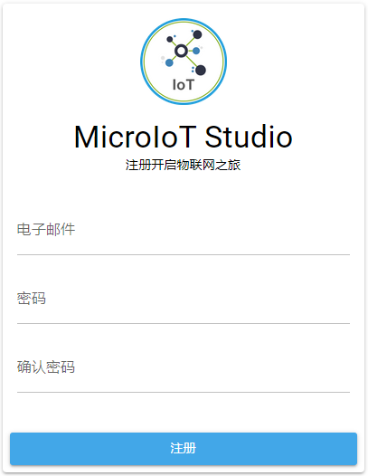

# 快速入门

本节将以共享单车为例，了解如何使用MicroIoT平台快速配置和监控设备。用户可以使用MicroIoT提供的web界面管理工具[MicroIoT Studio](/product/#microiot-studio)完成配置和监控工作，使用[MicroIoT Device](/product/#microiot-device)模拟物联网设备返回响应信息，以及上报事件和告警信息。所有这些工作都可以使用MicroIoT提供的API完成。下面是使用MicroIoT配置和监控共享单车所需要的步骤。

1. [注册MicroIoT用户](#注册microiot用户)
2. [配置共享单车场地类型](#配置共享单车场地类型)
3. [配置智能车锁设备类型](#配置智能车锁设备类型)
4. [添加共享单车](#添加共享单车)
5. [添加共享单车的智能车锁](#添加共享单车的智能车锁)
6. [设置智能车锁信息](#设置智能车锁信息)
7. [监控共享单车](#监控共享单车)

## 注册MicroIoT用户

使用MicroIoT之前，需要先注册MicroIoT用户。注册MicroIoT用户非常简单，只需要进入MicroIoT注册页面，输入电子邮件和密码，MicroIoT会为用户建立账户，账户用户名为电子邮件，系统同时建立同名的领域分配给该账户，用户登录后，可以在此领域内配置元数据信息、添加场地、设备，监控设备。

## 配置共享单车场地类型

注册好用户后，就可以开始配置场地类型，设备类型等元数据信息。MicroIoT中设备和场地都必须先定义对应的元数据：设备类型和场地类型，才可以配置设备和场地。

首先使用MicroIoT Studio登录平台，输入用户名和密码，领域可以输入，也可以登录后再选择。

点击导航栏中的场地类型，进入场地类型页面，在页面右上角点击下拉菜单，选择添加场地类型。

首先输入场地类型名称和描述，场地类型名称在领域内唯一。

点击继续，在场地类型属性信息部分，点击添加，添加属性model和sn，并输入属性model和sn的元数据信息，点击回退可以返回上一步修改场地类型的名称和描述，最后点击提交后就建好了共享单车场地类型。

## 配置智能车锁设备类型

下面配置设备的元数据信息：设备类型。

点击导航栏中的设备类型，进入设备类型页面，在设备类型页面右上角点击下拉菜单，选择添加设备类型。

输入设备类型名称和描述，设备类型名称必须在领域内唯一。

点击继续，进入设备类型动态属性信息部分，关于静态属性和动态属性的说明，请见[静态属性](#静态属性)。点击添加，添加设备的属性：location和locked，输入属性location和locked元数据信息。

点击继续，进入设备类型静态属性信息页面，智能车锁没有静态属性，接着点击继续，进入设备操作类型页面，点击添加，添加设备操作类型，输入操作类型名称和描述，操作类型名称在整个设备类型内唯一，点击确定进入getHistory操作类型请求信息详细页面。

在getHistory操作类型信息页面内，输入getHistory操作类型元数据信息，包括请求信息和响应信息。如果选择的数据类型是Struct或Choice，还需要输入附加信息描述Struct或Choice内部包含的属性的元数据信息。点击请求参数信息页面中的继续，可以输入Struct或Choice的附加信息。

点击设备操作类型信息页面的继续，进入设备告警类型信息页，点击添加，添加告警类型：StateChangedAlarm，输入告警类型元数据信息。

点击提交，智能车锁设备类型就建好了。

## 添加共享单车

创建好场地类型后，就可以添加场地。场地可以直接建在领域顶层，也可以建在某个场地内，该场地被称作新建场地的父场地。

点击导航栏中的设备，进入设备页面，点击页面右上角下拉菜单，选择添加场地。

在场地基本信息页内，显示了当前的父场地信息，从下拉框内选择场地类型，然后输入场地名称，场地名称在父场地内不能相互冲突。

点击继续，进入场地属性值页面，输入model和sn的属性值。

点击提交完成场地添加。

## 添加共享单车智能车锁

设备可以部署在场地内，也可以直接部署在领域的顶层。添加设备的时候需要先进入部署的场地内，场地内可以部署一个设备，也可以部署多个设备。

点击导航栏的设备，进入设备页面，点击设备要部署的场地，进入场地后，点击页面右上角下拉菜单，选择添加设备。

在设备基本信息页内，显示了当前的父场地信息，从下拉框内选择设备类型，然后输入设备名称，设备名称在父场地内不能相互冲突。

点击继续，进入设备静态属性值页面，智能厕所设备没有静态属性，可以直接点提交添加设备。设备建立好后，请注意保存设备的账户信息。

## 设置智能车锁信息

添加好设备后，必须在MicroIoT Device中设置设备模拟的属性值，操作响应信息，以及告警信息，才可以在MicroIoT Studio监控设备时收到设备的响应和告警。如果不设置设备信息，

使用新添加设备的账号，登录MicroIoT Device，设置设备信息。此时进入MicroIoT Studio设备信息页面，刷新页面后，设备图标会由断线图标变为连线图标，代表设备已上线。

点击导航栏的属性，进入属性页面，点击属性，进入属性信息页面，点击编辑设置属性值，设置完成后，点击保存完成属性值设置。

点击导航栏的操作，进入操作页面，点击操作getHistory，进入操作信息页面，点击编辑，设置操作的响应信息。设置完成后，点击保存完成操作响应值设置。

点击导航栏的告警，进入告警页面，点击告警StateChangedAlarm，进入告警信息页面，点击编辑，设置告警信息。设置完成后，点击保存完成告警信息设置。

## 监控共享单车

在MicroIoT Device内设置好属性，操作，告警信息后，就可以在MicroIoT Studio内监控该设备了。

重新返回MicroIoT Studio，点击导航栏内的设备，在设备页面内找到部署设备的场地，进入场地，在场地内找到设备，点击设备进入设备详细信息页面，准备开始监控该设备。

点击设备动态属性，展开设备属性，点击location属性的读取按钮，进入读取设备属性页面，可以读取location的属性值。同时在MicroIoT Device窗口会显示有用户读取属性值。

点击locked属性的设置按钮，进入设置设备属性页面，设置好属性值后，点击设置，设置locked属性的属性值，同时在MicroIoT Device窗口会显示有用户设置属性值，打开该属性，可以看到新设置的属性值。

点击设备操作，展开操作页面，点击执行getHistory操作，进入执行设备操作页面，输入请求信息后，点击执行，系统返回在MicroIoT Device中设置的响应信息，同时在MicroIoT Device窗口会显示有用户操作设备，设备操作信息页中将显示请求信息。

打开MicroIoT Device，点击导航栏内的属性，进入属性页面，点击location属性，进入属性信息页面，点击上报，上报location属性值。

打开MicroIoT Studio，进入设备详细信息页面，打开设备动态属性，点击location的查询按钮，会显示上报的事件信息。

在MicroIoT Studio设备详细信息页面，点击右上角的下拉菜单，选择订阅告警。订阅告警成功后，MicroIoT Studio会实时收到设备上报的告警信息。

进入MicroIoT Device，点击导航栏内的告警，进入告警页面，点击StateChangedAlarm告警，进入告警信息页面，点击上报，上报告警信息。此时MicroIoT Studio会发出告警音。

进入MicroIoT Studio，导航栏内的告警傍边会显示红色的告警总数，点击告警，进入告警页面，点击设备，进入设备告警详细信息页面，在告警详细信息页面中将实时显示告警详细信息。打开告警详细信息后，代表告警已读，导航栏内告警总数将减少一个。如果告警总数为零，则不显示。此时进入设备详细信息页面，如果告警总数大于零，设备图标显示红色。

