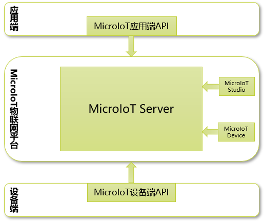

# 产品介绍

MicroIoT物联网平台提供了一整套工具满足用户管理、开发、测试、部署物联网产品的需要。

1. MicroIoT Server：MicroIoT服务器

2. MicroIoT API：MicroIoT应用编程接口

3. MicroIoT Studio：MicroIoT图形界面管理工具

4. MicroIoT Device：MicroIoT设备模拟器工具

## MicroIoT Server

MicroIoT Server是简化物联网产品开发，提供物联网服务的服务器，它提供物联网应用与设备之间双向通信通道，以及物联网大数据的存储和查询。

MicroIoT Server的主要特色：

- 软件定义物联网：通过软件集中管理物联网元数据信息，灵活配置和管理物联网，分离底层基础设施和应用，提高物联网产品开发效率。
- 标准接口：MicroIoT Server提供基于标准的RESTful API接口，严格按照资源加动作的方式设计接口，可以使用众多的REST客户端工具与MicroIoT Server交互。
- 统一大数据查询：为不同数据结构的物联网数据提供统一查询接口，提供自动转换API，用户不用关心底层数据。
- 内置用户权限：对于使用MicroIoT的用户严格限制权限，细粒度区分不同的访问区域。对每一次设备调用都执行严格的操作权限检查，保证设备访问的安全。
- 实时监测设备状态：MicroIoT Server在设备连接或断开时，会实时记录设备状态，并发送告警，保证物联网应用可以实时知道设备连接状态。
- 支持多种数据类型：支持定义多种数据类型的元数据，包括七种简单数据类型和三种复杂数据类型。
- 横向扩展：使用基于token的用户认证方式，所有接口保证无状态操作，服务器更加安全，支持服务器水平扩展。

## MicroIoT API

MicroIoT API将物联网应用和设备连接到MicroIoT物联网平台，使用平台提供的物联网服务。当前用户可以使用的编程语言包括Java和JavaScript。

MicroIoT API应用端主要提供以下几个方面API：设备监控API，统一查询API，管理API等。

MicroIoT API设备端主要提供一下几个方面API：监控API，事件上报API，告警上报API等。

MicroIoT API的主要特色：

- 断线自动重连：MicroIoT平台底层通信协议使用websocket，websocket协议是长连接协议。为了保证物联网可靠通信，必须建立稳定的重连机制解决网络不稳定的情况。MicroIoT API会在监测到断线的时候，每隔一段时间重新连接服务器，直到与服务器建立连接。
- 多平台连接：有时候物联网应用需要同时连接多个平台上的不同账号，与不同平台上的物联网设备通信，MicroIoT API支持同时设置多个不同平台上的账号与多个平台连接。物联网设备端也支持同时配置多个设备账户，与多个平台相连。
- 同步、异步调用：MicroIoT API即支持同步调用方式，也支持异步调用方式，用户可以根据自己的业务场景选择合适的调用方式。
- 业务和技术关注点分离：MicroIoT API屏蔽了底层的网络协议接口，数据序列化、反序列化操作，线程同步等通信协议栈技术细节，开发人员只需要关注业务功能，不需要了解底层通信机制。
## MicroIoT Studio

MicroIoT Studio是web界面MicroIoT系统管理工具，提供设备监控，元数据管理，设备管理，场地管理，设备组管理，领域管理，用户管理等功能。

MicroIoT Studio主要特色：                                                                    

- 以文件浏览器风格展示场地、设备关系，其中场地是目录，设备是文件。

- 监控任意类型设备，动态生成设备读取、设置、操作界面。

- 动态展示实时告警信息，实时显示告警总数，并实时在告警对象上显示告警状态。

## MicroIoT Device

采用微服务架构的MicroIoT平台存在微服务架构固有的缺点：由于拆分为微服务，增加了系统开发和测试的复杂度。为此MicroIoT平台提供了MicroIoT Device工具，以软件的方式模拟物联网硬件设备的读取、设置、操作，上报事件、告警信息，方便物联网应用开发和演示。
