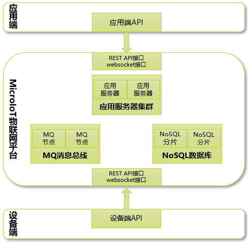

# 系统介绍

前面介绍了MicroIoT的核心概念，以及如何使用MicroIoT配置和监控物联网设备，本节将逐步深入到MicroIoT系统内部，了解系统内部的运行机制，为以后使用MicroIoT提供的API开发物联网产品奠定基础。

## 功能架构

MicroIoT物联网平台主要功能如下：

### 用户管理

MicroIoT系统有两种用户角色：

- 系统管理员：系统管理员管理整个MicroIoT系统的所有实体，可以订阅所有设备和场地的告警信息。MicroIoT安装好后有一个缺省的系统管理员admin。
- 区域管理员：区域管理员只能管理负责区域内包含的各种实体，一个区域可以是一个领域，也可以是一个场地或设备，一个区域管理员可以管理一个或多个区域，可以订阅该区域内各种实体的告警信息。

用户管理主要功能包括：用户注册，用户修改，用户删除，用户查询等功能。

### 设备管理

关于[设备][1]我们已经在核心概念部分介绍过，设备管理就是管理平台的物联网设备，只有通过平台注册的设备，才可以对其监控。主要功能包括：设备注册，设备修改，设备删除，设备查询等功能。

  [1]: concept.md#_2
  
### 设备监控

设备监控是MicroIoT平台最核心的功能，设备在平台上注册后，就可以通过平台提供的接口对设备执行读取、设置、操作，设备也可以通过平台提供的接口向平台上报事件、告警信息。

关于设备的读取、设置、操作等信息，请参见设备类型中[属性][1]的介绍。

### 场地管理

场地管理管理平台中的[场地][2]，包括场地添加，场地修改，场地删除，场地查询等功能。

  [2]: concept.md#_3
  
### 告警管理

场地和设备都可能产生告警，告警产生的来源可能是设备本身发现异常情况，另外MicroIoT本身也会在一些场景下产生告警，产生告警后，MicroIoT将自动将告警信息保存在平台中，并广播给所有订阅该告警类型的应用或设备。MicroIoT内置有多个默认告警类型。

- ConnectedAlarm：当设备连接到MicroIoT时，MicroIoT会上报ConnectedAlarm，应用端可以实时监测到设备连接状态。
- DisconnectedAlarm：当设备主动或被动退出MicroIoT时，MicroIoT会上报DisconnectedAlarm，应用端可以实时监测到设备离线。
- AttributeChangedAlarm：MicroIoT是基于微服务架构的系统，不可避免存在数据一致性问题，例如设备或场地修改名称时，应用端的设备或场地的名称仍然显示原来的名称，为了解决数据一致性的问题，MicroIoT在设备或场地修改属性时，会上报AttributeChangedAlarm，应用端收到告警后可以做出相应处理。

设备管理主要功能包括：告警接收，告警查询。

### 事件管理

设备向平台上报事件后，平台将保存事件信息，事件管理主要功能包括：事件接收，事件查询。关于事件的介绍，请参见核心概念中[设备][1]部分。

### 领域管理

领域管理主要功能包括：领域添加，领域删除，选择当前领域。关于[领域][3]的介绍请见核心概念章节。

  [3]: concept.md#_6
  
### 设备组管理

设备组管理主要功能包括：设备组添加，设备组删除，向设备组添加新设备，从设备组移除设备等。关于[设备组][4]的介绍请见核心概念章节。

  [4]: concept.md#_5
  
### 配置管理

配置管理主要配置告警订阅相关信息，包括配置订阅设备的告警，配置告警信息的置顶等。

### 收藏管理

收藏管理的主要目的是为用户方便选中要管理的设备或场地。

### 设备类型管理

管理领域内的[设备类型以及操作类型、告警类型][1]，主要功能包括：设备类型添加，设备类型修改，设备类型删除。

### 场地类型管理

管理领域内的[场地类型][2]，主要功能包括：场地类型添加，场地类型修改，场地类型删除。

## 技术架构

MicroIoT平台系统采用微服务架构，聚焦于提供物联网相关服务，对外提供标准REST API接口，支持多种编程语言调用，与用户的应用松耦合，方便物联网产品从应用端和设备端集成。MicroIoT平台内部采用无状态应用服务器集群提高系统可靠性和灵活横向扩展能力，可以按需伸缩，独立于物联网产品单独部署，降低部署与运维成本。

MQ消息总线支持分布式物联网系统，解耦应用和设备，持久性消息存储提高了系统可靠性，提供高可用性方案，另外MQ消息总线为保证应用与平台之间最终数据一致性提供了底层的技术支持。

NoSQL数据库分片集群提供高等级的数据可靠性，支持主从复制机制，可以实现自动故障恢复功能，自动提供数据水平扩展。应用与设备之间的监控底层通信使用websocket协议，上层使用stomp协议，以后将支持更多的物联网协议。

!!! note "注意"
    MicroIoT平台只专注于物联网相关服务，而一个物联网产品要提供给用户有价值的服务，需要多种业务、技术等多方面的配合，有价值的底层物联网服务并不能保证整个物联网产品有价值。

## 部署方式

MicroIoT物联网平台既可以部署在平台，也可以部署在云端。

- MicroIoT On-Premise：本地部署方式是传统的软件系统使用方式，MicroIoT部署在用户自己所在的经营场所中。所有的设备也必须部署在用户自己内部的网络中。本地部署方式需要用户负责整个平台的安全和管理，以支付平台的license的方式使用系统。
- MicroIoT SaaS：云端部署方式，MicroIoT部署在云服务提供商的服务器中，用户可以不用自己去构建相关的基础设施。所有的设备只要连到互联网即可监控。云端部署用户可以按需付费，不用关心系统安装和售后支持，因此也不需要相应的IT人员。
